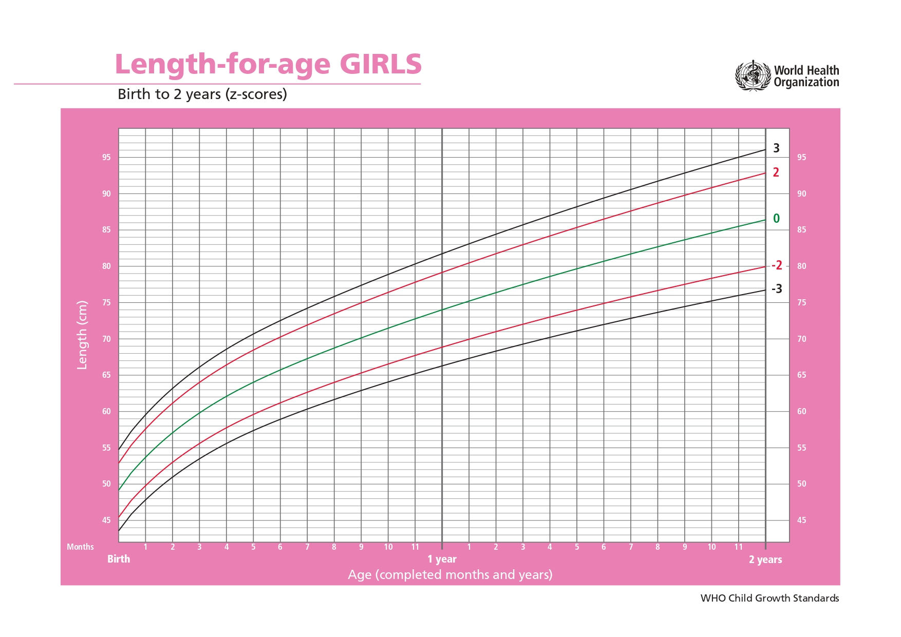
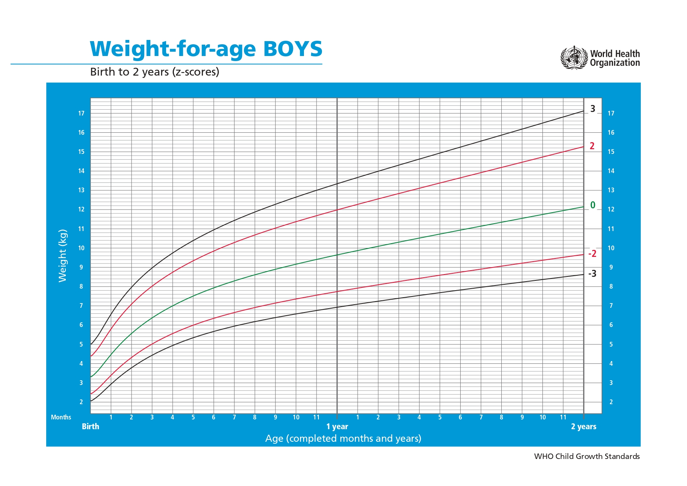
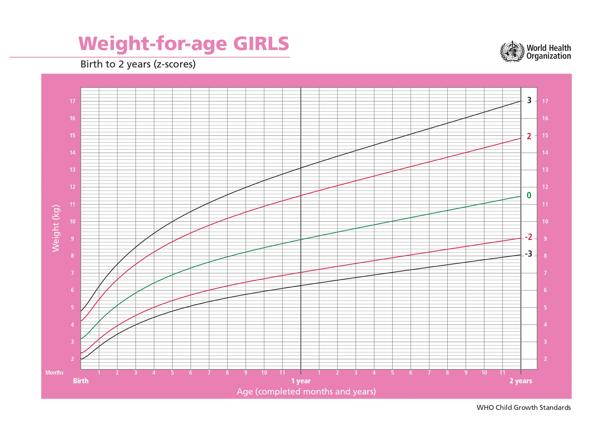

# Pendahuluan  

Kami membuat model deteksi stunting, wasting, dan risiko kehamilan untuk memenuhi main quest ML stack. Model ini dirancang untuk membantu masyarakat, khususnya para ibu, dalam mendeteksi kondisi gizi anak dan risiko kehamilan secara dini serta memberikan solusi berbasis data yang mudah diakses, yang dapat meningkatkan kualitas hidup dan kesehatan anak-anak di Indonesia.

# Alasan Kami Memilih Fitur Ini dan Menggunakan Model Ini  

Kami mengkritisi masalah orang tua yang tidak mengetahui apakah anak mereka mengalami stunting atau wasting, atau apakah kondisi kehamilan mereka berisiko. Ketidaktahuan ini sering menghalangi tindakan pencegahan yang dapat diambil lebih awal, yang penting untuk memastikan kesehatan ibu dan anak. Dengan fitur ini, kami ingin menyediakan alat diagnostik yang sederhana namun berbasis data, yang memungkinkan orang tua untuk memantau dan mengambil langkah pencegahan sejak dini, serta memberikan rekomendasi yang dapat mengurangi risiko stunting dan wasting pada anak-anak Indonesia.

# Persiapan Dataset

Organisasi Kesehatan Dunia (WHO) telah menetapkan kriteria standar untuk mengklasifikasikan status gizi, termasuk untuk kondisi **stunting** (pendek) dan **wasting** (kekurangan berat badan). **Stunting** terjadi ketika tinggi badan anak lebih rendah dari standar yang ditentukan untuk usia mereka, yang menunjukkan kurangnya asupan gizi jangka panjang yang berdampak pada perkembangan fisik. **Wasting** mengindikasikan kekurangan berat badan yang signifikan dan dapat menyebabkan masalah kesehatan akut.

Dalam bagian ini, kami akan menunjukkan **chart WHO** yang menggambarkan distribusi kelas **stunting** dan **wasting** berdasarkan data WHO. Chart ini memberikan gambaran mengenai prevalensi status gizi pada anak-anak dan ibu hamil yang dapat digunakan untuk analisis lebih lanjut.

## **Stunting WHO Chart**

Stunting adalah masalah gizi jangka panjang yang memengaruhi perkembangan anak. Di bawah ini adalah **chart WHO** yang menggambarkan **Stunting Pria** dan **Stunting Wanita**, berdasarkan standar pertumbuhan WHO.

### **Stunting Pria dan Stunting Wanita**

    <h3>Stunting WHO Chart</h3>

  

    <h4>Stunting Pria</h4>
    
  

  

    <h4>Stunting Wanita</h4>
    
  

---

## **Distribusi Kelas Stunting**

Setelah memaparkan chart WHO, kami juga akan menunjukkan **distribusi kelas stunting** dalam dataset yang digunakan. Berikut adalah distribusi kelas **stunting** yang mengklasifikasikan kondisi anak berdasarkan tinggi badan sesuai dengan standar WHO.

- **Severely Stunted**: Anak dengan tinggi badan yang jauh di bawah standar usia mereka.
- **Stunted**: Anak yang tinggi badannya lebih pendek dari standar usia mereka, tetapi tidak terlalu jauh.
- **Normal**: Anak dengan tinggi badan sesuai dengan standar usia mereka.
- **Tall**: Anak dengan tinggi badan lebih tinggi dari standar usia mereka.

### **Distribusi Kelas Stunting**

    <h3>Distribusi Kelas Stunting</h3>

    

---

## **Wasting WHO Chart**

Wasting adalah masalah kesehatan akut yang terjadi ketika anak kekurangan berat badan yang signifikan. Berikut adalah **chart WHO** yang menggambarkan **Wasting Pria** dan **Wasting Wanita** berdasarkan standar WHO.

### **Wasting Pria dan Wasting Wanita**

    <h3>Wasting WHO Chart</h3>

  

    <h4>Wasting Pria</h4>
    
  

  

    <h4>Wasting Wanita</h4>
    
  

---

## **Distribusi Kelas Wasting**

Dataset kami juga menyertakan **distribusi kelas wasting**, yang mengklasifikasikan kondisi berat badan anak sesuai dengan kategori WHO.

- **Severely Underweight**: Anak dengan berat badan yang jauh lebih rendah dari standar untuk usia mereka.
- **Underweight**: Anak dengan berat badan lebih rendah dari standar untuk usia mereka, tetapi tidak terlalu jauh.
- **Normal Weight**: Anak dengan berat badan yang sesuai dengan standar usia mereka.
- **Risk of Overweight**: Anak dengan berat badan yang lebih tinggi dari standar untuk usia mereka.

### **Distribusi Kelas Wasting**

    <h3>Distribusi Kelas Wasting</h3>

    

---

## **Kesimpulan**

Dengan menggunakan chart WHO untuk stunting dan wasting, serta distribusi kelas dalam dataset kami, kita dapat memahami lebih baik prevalensi masalah gizi di kalangan anak-anak di Indonesia. Visualisasi ini akan membantu dalam pengembangan model prediksi dan diagnosis yang lebih akurat dalam mendeteksi risiko stunting dan wasting pada anak-anak.

---

README ini telah disesuaikan dengan penjelasan dan struktur yang terorganisir dengan baik. Jika Anda membutuhkan penyesuaian lebih lanjut atau tambahan, beri tahu saya!

