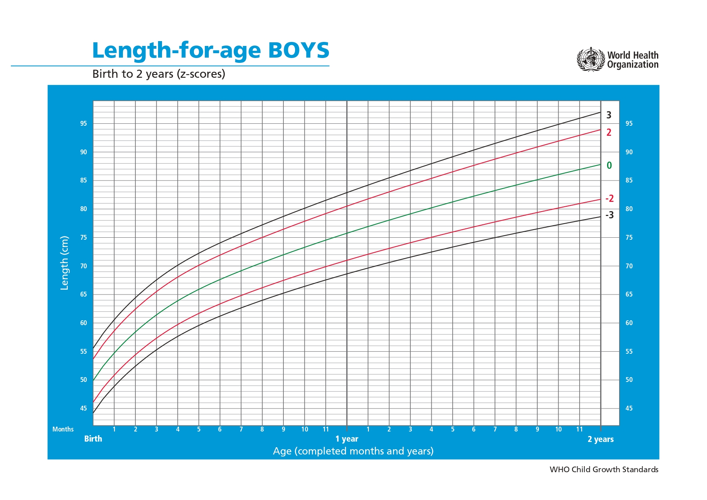

Here is the translated document with the same structure:

---

# Introduction

We developed a detection model for **stunting**, **wasting**, and **maternal health risks** to fulfill the main quest of the ML stack. This model is designed to assist the community, especially mothers, in early detection of children’s nutritional conditions and pregnancy risks. It provides data-driven solutions that are easily accessible. The primary goal of this model is to improve the quality of life and health of children in Indonesia, particularly in addressing the ongoing challenges of stunting and wasting.

---

# Why We Chose These Features and This Model

We observed that many parents are unaware of whether their children are experiencing **stunting** or **wasting**, or whether their pregnancy is at risk. This lack of knowledge often prevents early preventive measures, which are crucial for ensuring the health of both mother and child. Through this feature, we aim to provide a simple yet data-driven diagnostic tool that allows parents to monitor their children's nutritional conditions and take early preventive actions. Additionally, the tool offers data-based recommendations to mitigate the risk of stunting and wasting among Indonesian children.

---

# Dataset Preparation

The World Health Organization (WHO) has established standard criteria to classify nutritional statuses, including conditions like **stunting** (short stature) and **wasting** (underweight).  

- **Stunting** occurs when a child’s height is below the standard for their age, indicating long-term nutritional deficiencies that impact physical development.  
- **Wasting** signifies a significant underweight condition, often due to acute malnutrition or illnesses that affect the child’s weight over a short period.  

In this section, we present the class distribution and dataset division based on indicators such as **HAZ (Height-for-Age Z-score)** for stunting and **WAZ (Weight-for-Age Z-score)** for wasting.  

---

## **Stunting WHO Chart and Dataset Class Distribution**

**Stunting** refers to chronic malnutrition that results in a child’s height being lower than the standard for their age.  

### **Stunting Categories (HAZ):**
- **Severely Stunted:** Height less than -3 SD.  
- **Stunted:** Height between -3 SD and -2 SD.  
- **Normal:** Height between -2 SD and +3 SD.  
- **Tall:** Height greater than +3 SD.  

### **Stunting WHO Chart Visualization**

    <h3>Stunting WHO Chart</h3>

  

    <h4>Stunting (Male)</h4>
    
  

  

    <h4>Stunting (Female)</h4>
    
  

---

### **Stunting Class Distribution**

The following chart illustrates the class distribution for stunting in the dataset, depicting the prevalence of children based on their height measurements.  

    <h3>Stunting Class Distribution</h3>

    

---

## **Wasting WHO Chart and Dataset Class Distribution**

**Wasting** indicates acute nutritional deficiency when a child’s weight is below the standard for their age.  

### **Wasting Categories (WAZ):**
- **Severely Underweight:** Weight less than -3 SD.  
- **Underweight:** Weight between -3 SD and -2 SD.  
- **Normal:** Weight between -2 SD and +1 SD.  
- **Risk of Overweight:** Weight greater than +1 SD.  

### **Wasting WHO Chart Visualization**

    <h3>Wasting WHO Chart</h3>

  

    <h4>Wasting (Male)</h4>
    
  

  

    <h4>Wasting (Female)</h4>
    
  

---

### **Wasting Class Distribution**

The chart below illustrates the class distribution for wasting in the dataset, showing the prevalence of children based on their weight measurements.  

    <h3>Wasting Class Distribution</h3>

    

---

# Maternal Health Risk

### Introduction
The maternal health risk detection model is designed to help identify risky medical conditions in pregnant women, such as hypertension, diabetes, and heart problems. The goal of this model is to detect potential health issues during pregnancy early and provide data-based solutions to reduce risks for both mother and baby.

### Why We Chose This Feature and Model
We chose this feature because many pregnant women are unaware of potential health risks that could endanger themselves and their babies. Early detection of conditions like hypertension and glucose abnormalities can significantly reduce maternal and infant mortality rates. This model aims to provide a simple yet data-driven prediction tool for pregnant women.

### Dataset Preparation
This dataset contains medical records of pregnant women with features such as age, blood pressure, blood sugar levels, body temperature, heart rate, and pregnancy risk levels. This data is used to train the model to predict pregnancy risks based on medical indicators.

### Dataset Details
The **Maternal Health Risk** dataset consists of 1014 entries with 7 key columns:
- **Age**: Age of the pregnant woman.  
- **SystolicBP**: Systolic blood pressure.  
- **DiastolicBP**: Diastolic blood pressure.  
- **BS**: Blood sugar levels.  
- **BodyTemp**: Body temperature.  
- **HeartRate**: Heart rate.  
- **RiskLevel**: Pregnancy risk level (High risk, Low risk, Mid risk).  

### Dataset Source
This dataset is from the [UCI Machine Learning Repository](https://archive.ics.uci.edu/dataset/863/maternal+health+risk). Thanks to the dataset provider for enabling this model's development.

### Class Distribution
The dataset contains three categories in **RiskLevel**:
- **High risk**: High risk.  
- **Low risk**: Low risk.  
- **Mid risk**: Moderate risk.  

The class distribution is as follows:

    <h3>Maternal Health Risk Class Distribution</h3>

    

---

# Model Results in the Application

After the model was saved in TensorFlow Lite (TFLite) format, it was integrated into an Android application to provide real-time predictions. The app receives user inputs and displays prediction results directly on the device screen.

### Stunting and Wasting Predictions

The first part of the app provides predictions related to Stunting and Wasting, helping parents detect their child's nutritional conditions based on height and weight data.

The following image shows how prediction results for Stunting and Wasting are displayed, providing information on whether a child experiences Stunting, Wasting, or Normal conditions based on their height and weight.

- **Stunting**: Displays whether the child falls into the Severely Stunted, Stunted, or Normal category based on their height.  
- **Wasting**: Displays whether the child is Severely Underweight, Underweight, or Normal based on their weight.  

### Maternal Health Risk Prediction

The second part of the app provides predictions related to Maternal Health Risks, helping pregnant women monitor their health by detecting risky medical conditions such as hypertension, diabetes, and heart problems.

The following image shows how prediction results for Maternal Health Risks are displayed, providing information about the pregnancy risk level based on medical data such as blood pressure, glucose levels, body temperature, and heart rate.

- **High risk**: High risk, indicating potential serious complications.  
- **Low risk**: Low risk, indicating no signs of serious complications.  
- **Mid risk**: Moderate risk, indicating some factors to monitor to prevent complications.  

---