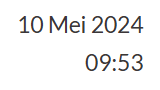

# Side Quest: Domain-Specific Chatbot with Gemini 1.0 Pro 002 

✅ It is recommended to build two models if you want to model using Vertex AI. First Model: Use TensorFlow to build models from scratch (Transfer Learning is allowed).  Second Model: Use Vertex AI for Generative AI use cases.

✅ It is highly recommended to create your own or do your own fine tuning when solving Generative AI use cases.

## Introduction  
We present a domain-specific chatbot developed through fine-tuning the **Gemini 1.0 Pro 002** base model in Vertex AI Studio. This project leverages the text-to-text generation capabilities of Gemini 1.0 Pro 002 to create a chatbot that can swiftly and accurately address frequently asked questions related to maternal and child health.  

## Why We Chose This Feature  
We identified a common issue with existing doctor consultation platforms: response times are often too long for patients seeking urgent answers.  

<table style="width: 100%;">
  <tr>
    <td style="width: 50%; text-align: center;">
      <h4>Patient Inquiry Time</h4>
      
    </td>
    <td style="width: 50%; text-align: center;">
      <h4>Doctor Response Time</h4>
      
    </td>
  </tr>
</table>

This delay causes discomfort for expectant mothers, new parents, and young mothers who need prompt answers. To tackle this issue, we designed a domain-specific chatbot capable of delivering accurate answers to frequently asked questions.

---

## Fine-Tuning Preparation  

### 1. Preparing the Model  
We selected the best model from the Model Garden in Vertex AI to support the domain-specific chatbot feature.  

<div style="text-align: center;">
  <h4>Model Garden in Vertex AI</h4>
  
  
</div>

After evaluating various options, we chose **Gemini 1.0 Pro 002** for fine-tuning because:  

- It supports **text-to-text generation**, aligning with our use case and prompts.  
- It balances quality, performance, and cost for tasks like **content generation**, **editing**, **summarization**, and **classification**.  
- It fits the chatbot requirements for maternal and child health topics.  

---

### 2. Preparing the Dataset  
We gathered data from doctor consultation platforms to obtain question-answer pairs.  

**Sources of Question-Answer Data:**  
- [Alodokter - Baby Health Community](https://www.alodokter.com/komunitas/topic-tag/bayi)  
- [Alodokter - Stunting Community](https://www.alodokter.com/komunitas/topic-tag/stunting)  

To handle repetitive questions on these platforms, we utilized Generative AI to augment common question-answer pairs. The resulting dataset is compiled into a CSV file:  

- [Dataset (CSV)](https://github.com/Jabir0/Machine-Learning-GIZI/blob/main/Side%20Quest%20model%20(finetuning%20gemini%201.0%20in%20Vertex%20AI%20Studio)/dataset/persiapan_dataset_qna.csv)  

**Dataset Distribution:**  
- **60%** of the data is sourced from doctor consultation platforms.  
- **40%** of the data is generated using Generative AI.  

**Fine-Tuning Dataset Requirements:**  
The dataset prepared for Gemini 1.0 Pro 002 follows this structure:  

```jsonl
{
  "messages": [
    {
      "role": "string",
      "content": "string"
    }
  ]
}
```  

Key details:  
- **Role**: Can be `system`, `user`, or `model`.  
- **Content**: Contains the message text with a combined context and message token limit of **32,768 tokens**.  
- **System role** is used only as the first element in the array (optional).  
- Maximum token length per `model` message is **8,192 tokens**.  

For the **system** role, we defined it as a pediatrician, general practitioner, and nutritionist providing health education to parents. The **user** role contains user/patient queries, while the **model** role includes the doctor’s response.  

Example:  
```jsonl
{
  "messages": [
    {
      "role": "system",
      "content": "Anda adalah dokter spesialis anak yang memberikan edukasi dan saran mengenai kesehatan anak dan perawatan bayi."
    },
    {
      "role": "user",
      "content": "Dokter, bayi saya usia 4 bulan sekarang sedang pilek. Saya lebih suka menggunakan pengobatan alami terlebih dahulu. Bagaimana cara mengatasi pilek dengan cara alami? Mohon sarannya."
    },
    {
      "role": "model",
      "content": "Pilek pada bayi sering disebabkan oleh infeksi virus. Meskipun pengobatan medis mungkin diperlukan untuk gejala yang parah, berikut beberapa cara alami yang dapat membantu:\n\n1. **Humidifier**: Gunakan humidifier di kamar bayi untuk menjaga kelembapan udara. Ini membantu meredakan hidung tersumbat dan mengurangi iritasi.\n2. **Kompres hangat**: Tempelkan kain hangat pada wajah bayi, terutama di area hidung dan dada, untuk membantu melegakan pernapasan dan mengurangi ketidaknyamanan.\n3. **Atur posisi tidur**: Tidurkan bayi dengan posisi kepala sedikit lebih tinggi untuk mengurangi hidung tersumbat dan mempermudah pernapasan.\n4. **Udara bersih**: Pastikan udara di sekitar bayi bebas dari polusi atau asap rokok, karena dapat memperburuk pilek.\n\nJika pilek disertai demam tinggi, kesulitan bernapas, atau berlangsung lebih dari beberapa hari, segera konsultasikan dengan dokter anak."
    }
  ]
}
```  

Full dataset: [Q&A Dataset (JSONL)](https://github.com/Jabir0/Machine-Learning-GIZI/blob/main/Side%20Quest%20model%20(finetuning%20gemini%201.0%20in%20Vertex%20AI%20Studio)/dataset/dataset_qna_fix.jsonl)  

The processed dataset was stored in a Google Cloud Storage bucket for fine-tuning.  

<div style="text-align: center;">
  <h4>Cloud Storage Bucket</h4>
  
</div>

---

### 3. Fine-Tuning Settings  

<div style="text-align: center;">
  <h4>Fine-Tuning Configuration</h4>
  
  
</div>

---

## Results  

### Fine-Tuning Metrics  
During the fine-tuning process, we monitored the metrics:  

<div style="text-align: center;">
  <h4>Monitoring Fine-Tuning Progress</h4>
  
</div>

---

### Test Results  
The fine-tuned chatbot successfully answered general questions with high relevance in Vertex AI Studio's testing environment.  

<div style="text-align: center;">
  <h4>Chatbot Testing</h4>
  
  
</div>

---

## Deployment  
After completing the fine-tuning, the `chatbot_gizi_model` was handed over to the **Cloud Computing cohort** team to create an endpoint. This endpoint will serve as the backend for chatbot integration into the application.

--- 

# Model Results in the Application 📲


<div style="text-align: center;">
        <h3>Chatbot Result in APK</h3>
        
    </div>